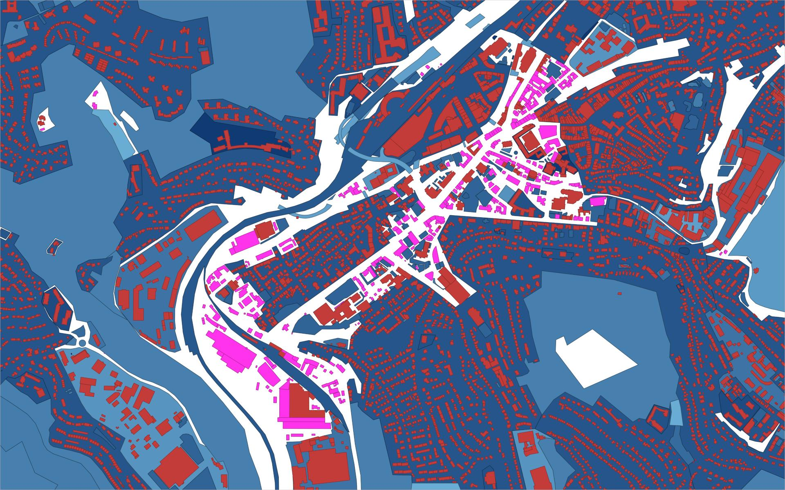
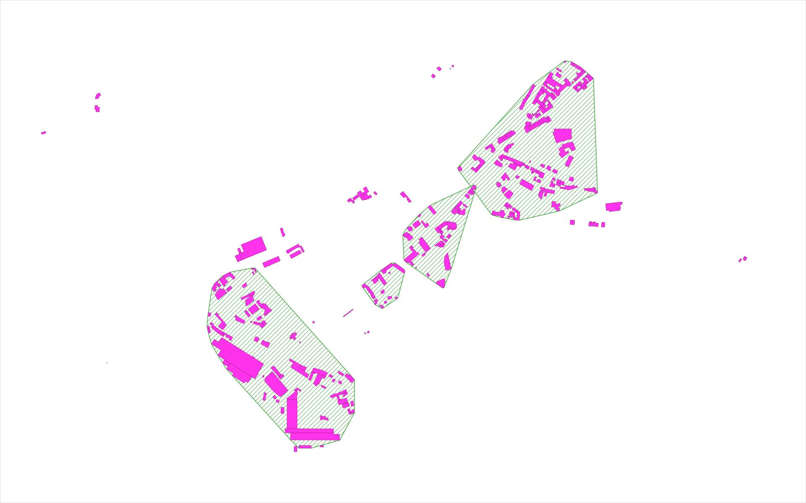
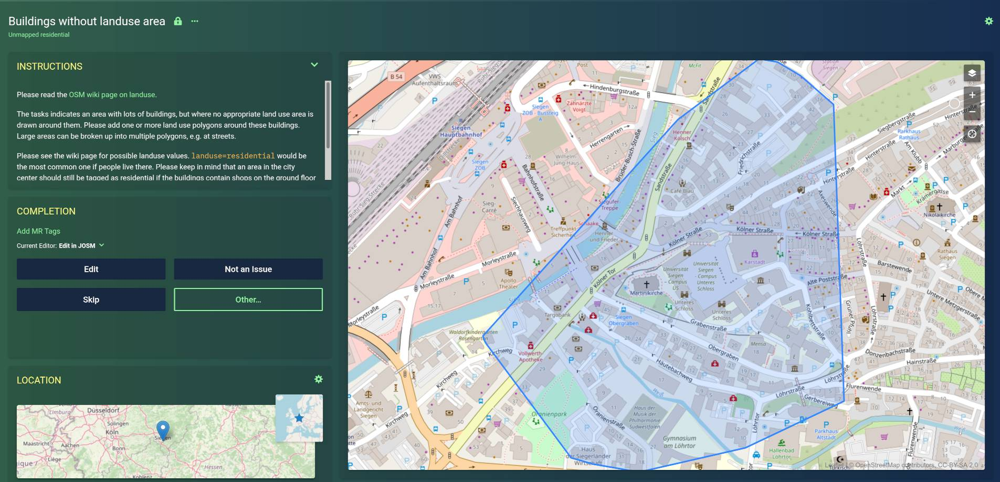

# [MapRoulette: Buildings without landuse](https://maproulette.org/browse/challenges/17667/)

OpenStreetMap maps land use, the primary use of a land area by humans. Typical
uses are residential, commercial, industrial, and so on. See the
[OpenStreetMap wiki on land use](https://wiki.openstreetmap.org/wiki/Key:landuse)
for details.

This project looks at buildings in Germany which are not surrounded by an
appropriate land use area. If there are e.g. many residential buildings in an
area, one would expect that there’s a residential land use polygon surrounding
them. Groups of such buildings are fed as mapping tasks into
[MapRoulette](https://maproulette.org/browse/challenges/17667/), a
micro-tasking platform for OpenStreetMap contributors, where they can improve
the map by adding the land use areas and other details, one task at a time.

This is the sister project of
[landuse_without_buildings](https://github.com/hfs/landuse_without_buildings)
which looks at the opposite problem of land use areas without any buildings in
them.


## Processing steps

### [01_download.sh](01_download.sh) – Download data

Download recent
[OpenStreetMap data dumps for the German federal states from Geofabrik](https://download.geofabrik.de/europe/germany.html)
as input data. The processing has to be split by state, because it takes too
long otherwise, and also because it can be partially parallelized this way.

### [02_createdb.sh](02_createdb.sh) – Create database

Create the PostGIS database where the data analysis will happen.

### [03_import_osm.sh](03_import_osm.sh) – Import OSM data

Filter the OpenStreetMap data for residential and other relevant land uses and
buildings. OpenStreetMap contains all kinds of geospatial data, e.g. roads,
shops and schools. We are only interested in land use areas and buildings. Note
that land use is not only defined by the tag key `landuse=*`, but can also be
defined as `amenity` for school/university grounds, `leisure` for parks, and so
on. The filter is defined in
[residential_and_buildings.lua](residential_and_buildings.lua).

### [04_analyze.sh](04_analyze.sh) – Intersect the data sets

Now intersect the data sets and remove and buildings which are contained in or
touch any land use area. Only the buildings without any surrounding land use
remain. Create clusters of these buildings by proximity. Only use clusters with
a minimum of buildings to make sure that only the most urgent cases are worked
on. Each cluster becomes one task in MapRoulette.

The data looks like this:



The blue areas are land use areas. Red are buildings. Pink on white background
are buildings which are not surrounded by a land use area. These are the
buildings to be identified for the tasks.

The buildings are then clustered by proximity with a minimum number of
buildings per cluster. The convex hull of all buildings in the cluster then
becomes the polygon for the task.



The hatched green areas are the polygons for each task. Pink are buildings
without land use. The polygons are only meant as hint to the mapper where to
look, not as proposed land use polygon. Note that not all buildings are covered
if their cluster contains too few buildings.

### [05_export_geojson.sh](05_export_geojson.sh) – GeoJSON export

Export the clusters’ convex hull as polygon geometry in GeoJSON format that can
be uploaded to MapRoulette.

Only the 1000 biggest tasks (by number of contained buildings) are exported, to
get a manageable challenge. These should be the most important cases.



### [06_upload_results.sh](06_upload_results.sh) – Upload output

This is a convenience script for myself to upload updated versions of the
output files as GitHub gist, from where they will be pulled by MapRoulette. The
data should be refreshed every few weeks, to account for changes done by other
mappers outside of MapRoulette. If the data gets stale, it becomes frustrating
for MapRoulette users to get assigned tasks where nothing is left to do.

### [07_maproulette_refresh.py](07_maproulette_refresh.py) – Update MapRoulette challenge

Refresh the challenge after the data has been updated.


## How to run the analysis yourself

You can run the analysis yourself, e.g. for newer data for a different country
or if you want to modify the criteria.

The processing for Germany requires about 100 GB of temporary disk space and 1
hour of computation time.

### Using Docker and Docker Compose

This is the easier way if you already have [Docker](https://www.docker.com/)
and don’t want to bother with the dependencies.

```
docker-compose up
```

The output files are `data/*.geojson`.

### Running manually

Install PostgreSQL, PostGIS, `osm2pgsql`, `osmconvert` and `osmfilter` (package
`osmctools`) and `npm`.

Install [geojson-rewind](https://github.com/mapbox/geojson-rewind)
using `npm install -g @mapbox/geojson-rewind`.

Edit `env.sh` to set the PostgreSQL credentials.

Run `./run.sh` to execute all processing steps, or call the single scripts to
run specific steps.


## License

The source code of this project is licensed under the terms of the
[MIT license](LICENSE).

As the output data is a Derivative Work of OpenStreetMap data, is has to be
licensed under [ODbL](https://opendatacommons.org/licenses/odbl/). Please refer
to the [OSM Copyright](https://www.openstreetmap.org/copyright/) page and the
information linked there.
